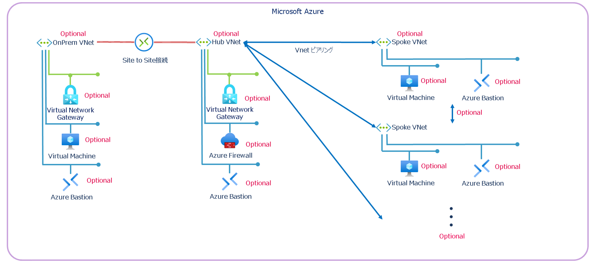

<h1>Hub & Spoke 検証用テンプレート</h1>

## 目次

1. [目次](#概要)
2. [Azure へのデプロイ](#azure-へのデプロイ)
3. [構成](#構成---hub--spoke)
4. [概要](#概要)
5. [シナリオ](#シナリオ)
6. [デプロイに関する注意事項](#デプロイに関する注意事項)
   1. [一般](#一般)
   2. [サブネット IP アドレス範囲の使用](#サブネット-ip-アドレス範囲の使用)
   3. [リソース名](#リソース名)
7. [Azure Monitor エージェント、VM Insights、Dependency エージェント](#azure-monitor-エージェントvm-insights-および-dependency-エージェント)
8. [Azure 仮想ネットワーク マネージャー](#azure-仮想ネットワーク-マネージャー)
9. [パラメーターの概要](#パラメーターの概要)
10. [展開後のガイダンス](#展開後のガイダンス)

## Azure へのデプロイ

| 説明 | テンプレート |
|---|---|
| Azure サブスクリプションへのデプロイ |[](https://portal.azure.com/#blade/Microsoft_Azure_CreateUIDef/CustomDeploymentBlade/uri/https%3A%2F%2Fraw.githubusercontent.com%2Fshuhei0720%2FAzure-Hub-Spoke%2Frefs%2Fheads%2Fmaster%2FARM%2Fmain.json/uiFormDefinitionUri/https%3A%2F%2Fraw.githubusercontent.com%2Fshuhei0720%2FAzure-Hub-Spoke%2Frefs%2Fheads%2Fmaster%2FuiDefinition.json)|

> :warning: **警告:**
> **このテンプレートは、検証目的でのみ利用してください!!**
> **本番環境へのデプロイは避けてください!!**
<br>

## 構成 - Hub & Spoke



## 概要

このテンプレート は、Azure の Hub & Spoke トポロジーの検証目的で、迅速なデプロイを可能にします。Azure Virtual Machines、Azure Firewalls、Azure Virtual Network Gateways、Azure Bastion Hosts、Spoke の数を含む全てのモジュールがオプションで選択でき、様々なシナリオに対応可能です。

オプションでデプロイ可能なモジュール：

- **Hub（VNET または vWAN）内の Azure Firewall（標準またはプレミアム）とルートテーブル**
- **Hub & Spoke トポロジーの Azure Virtual Network Manager (AVNM) とオプションで直接接続されたネットワークグループ**
- **Spoke VNET 内の仮想マシン**
- **Hub VNET 内の Bastion Host**
- **仮想マシンへの Azure Monitor Agent と Dependency Agent**
- **poke-to-Spoke およびインターネット トラフィックを有効にする Azure Firewall ルール コレクショングループ**
- **オプションで仮想的な「オンプレミス」VNET のシミュレーション：**
  - **VPN Gateway**
  - **Hub（VNET または vWAN）へのサイト間 VPN 接続**
  - **Bastion Host**
  - **仮想マシン**

※ デプロイ時に、デプロイする Spoke VNET の数を指定可能です。Hub と Spoke が両方デプロイされる場合、VNET ピアリングが作成されます。AVNM と共にデプロイする場合、VNET ピアリングは AVNM によって管理されます。

※ ハイブリッド接続のシミュレーションとして、オプションで「オンプレミス」VNET をデプロイできます。オンプレミス VNET に Bastionホスト、仮想マシン、仮想ネットワークゲートウェイを追加することが可能です。また、Hub が VPN Gateway を持つ場合、サイト間 VPN 接続もデプロイ可能です。

※ Azure Virtual Network Manager は Hub & Spoke トポロジーでのみサポートされています。

## シナリオ

Lab Builder では、4つの**主要な**シナリオをデプロイ可能です。

1. **Spoke のみ**をデプロイ
2. **VNET Hub** または **Azure Virtual Hub** のみをデプロイ
3. **Hub または vWAN Hub と Spoke** をデプロイ
4. **Hub または vWAN Hub と Spoke** および **OnPrem** をデプロイし、ハイブリッド接続をシミュレーション

これらの**主要な**シナリオの中で、複数のオプションが利用可能です（柔軟にカスタマイズ可能です）。

|シナリオ|デプロイされる内容|
|-|-|
|**1. Spokes のみをデプロイ**|- **リソースグループ** (rg-Spoke)<br>- **仮想ネットワーク** (VNET-Spoke)<br>- **ネットワーク セキュリティ グループ** (NSG-Spoke) を「Default」サブネットにリンク<br>- **サブネット** (Default)<br>- [オプション] **サブネット** (AzureBastionSubnet)<br>- [オプション] **サブネット** (AzureFirewallSubnet)<br>- [オプション] **Azure Bastion ホスト** (Bastion-Spoke)、パブリック IP を含む<br>- [オプション] **仮想マシン** (Windows)<br><br>*Hub にファイアウォールがある場合のみ:*<br>- **ルートテーブル** (RT-Hub) を「Default」サブネットにリンクし、デフォルトルートを Azure Firewall に設定|
|**2. Hub または vWAN Hub のみをデプロイ**|- **リソースグループ** (rg-Hub)<br>- **仮想ネットワーク** (VNET-Hub)<br>- [オプション] **サブネット** (AzureBastionSubnet)<br>- [オプション] **サブネット** (AzureFirewallSubnet)<br><br>- [オプション] **サブネット** (GatewaySubnet)<br>- [オプション] **Azure Bastion ホスト** (Bastion-Hub)、パブリック IP を含む<br>- [オプション] **Azure Firewall** (AzFw)、パブリック IP を含む<br>- [オプション] **Azure Firewall ポリシー** (AzFwPolicy)<br>- [オプション] **Azure Firewall ポリシー ルール コレクション グループ**<br>- [オプション] **仮想ネットワーク ゲートウェイ**<br><br>*Hub にファイアウォールがある場合のみ:*<br>- **ルートテーブル** (RT-Hub) を「Default」サブネットにリンクし、デフォルトルートを Azure Firewall に設定|
|**3. Hub または vWAN Hub と Spokes をデプロイ**|シナリオ 1 、 2 の内容＋α:<br>- **VNET ピアリング**|
|**4. Hub または vWAN Hub と Spokes + OnPrem をデプロイ**|シナリオ 1、2、3 の内容＋α:<br>- **リソースグループ** (rg-OnPrem)<br>- **仮想ネットワーク** (VNET-OnPrem)<br>- **ネットワーク セキュリティ グループ** (NSG-OnPrem) を「Default」サブネットにリンク<br>- **サブネット** (Default)<br>- [オプション] **サブネット** (AzureBastionSubnet)<br>- [オプション] **サブネット** (GatewaySubnet)<br>- [オプション] **Azure Bastion ホスト** (Bastion-Hub)、パブリック IP を含む<br>- [オプション] **Azure 仮想マシン** (Windows)<br><br>*Hub にのみ適用:*<br>- [オプション] **Hub ゲートウェイへのサイト間 VPN 接続**|

## デプロイに関する注意事項

### 一般

- vWAN Hub と Spokes を選択した場合、VNET 接続がデプロイされます
- Hub と Spoke を選択した場合、VNET ピアリングがデプロイされます
- 仮想マシンに対して ICMPv4 ファイアウォール ルールが有効化されます
- Windows VM イメージは Windows Server 2022 Datacenter Gen2 です
- Linux VM イメージは Ubuntu Server 22.04 LTS Gen2 です
- Azure Firewall が選択されている場合、デフォルトルート（プライベートおよびパブリック）を含むルートテーブルが vWAN Hub にデプロイされます
- Azure Firewall が選択されている場合、デフォルトルートを含むルートテーブル (UDR) がデプロイされます（0.0.0.0/0 -> Azure Firewall）
- ネットワーク セキュリティ グループは「default」サブネットのみに適用されます
- デプロイ時には /16 のサブネットを使用してください。各 VNET (Hub と Spoke VNET) は /24 サブネットを取得します
- Hub VNET は常に最初に使用可能な /24 アドレス空間を取得します。例: 172.16.0.0/24
- Spoke(s) VNET は次のアドレス空間を取得します。例: 172.16.1.0/24, 172.16.2.0/24 等
- OnPrem VNET は常に最後に使用可能な /24 アドレス空間を取得します。例: 172.16.255.0/24
- サブネットの詳細については以下を参照:

### サブネット IP アドレス範囲の使用

*Spoke VNET のサブネット:*

|サブネット名|サブネット アドレス範囲|備考|
|-|-|-|
|default|x.x.Y.0/26||
|AzureBastionSubnet|x.x.Y.64/26|Bastion が選択されている場合のみ|

*Hub VNET のサブネット:*

|サブネット名|サブネット アドレス範囲|備考|
|-|-|-|
|AzureFirewallSubnet|x.x.0.4/26|Azure Firewall を選択した Hub VNET のみ適用|
|AzureBastionSubnet|x.x.0.64/26|Bastion が選択されている場合のみ|
|GatewaySubnet|x.x.0.128/26|Gateway が選択されている場合のみ|

*Azure Virtual WAN Hub のサブネット:*

|サブネット名|サブネット アドレス範囲|備考|
|-|-|-|
|n/a|x.x.0.0/24||

*OnPrem VNET のサブネット:*

|サブネット名|サブネット アドレス範囲|備考|
|-|-|-|
|default|x.x.255.0/26||
|AzureBastionSubnet|x.x.255.64/26|Bastion が選択されている場合のみ|
|GatewaySubnet|x.x.255.128/26|Gateway が選択されている場合のみ|

### リソース名

| タイプ | 名前 |
|-|-|
| Hub VNET | VNET-Hub |
| Spoke VNET | VNET-Spoke# |
| Spoke 仮想マシン | VM-Spoke# |
| Hub ルート テーブル | RT-Hub |
| Spoke ルート テーブル | RT-Spoke# |
| Hub Bastion ホスト | Bastion-Hub |
| Spoke Bastion ホスト | Bastion-Spoke# |
| Hub ネットワーク セキュリティ グループ | NSG-Hub |
| Spoke ネットワーク セキュリティ グループ | NSG-Spoke# |
| Hub Azure Firewall | Firewall-Hub |
| Hub 仮想ネットワーク ゲートウェイ | Gateway-Hub |
| OnPrem VNET | VNET-OnPrem |
| OnPrem 仮想マシン | VM-OnPrem |
| OnPrem Bastion ホスト | Bastion-OnPrem |
| OnPrem ネットワーク セキュリティ グループ | NSG-OnPrem |
| OnPrem 仮想ネットワーク ゲートウェイ | Gateway-OnPrem |
| Azure 仮想ネットワーク マネージャー | LabBuilder-AVNM |

## Azure Monitor エージェント、VM Insights および Dependency エージェント

- Azure Monitor エージェントはすべての仮想マシン (Windows と Linux) に展開されます。
- データ収集ルール (DCR) が Hub リソース グループに展開され、すべての仮想マシンに関連付けられます。
- データ収集ルールには、Service Map (Dependency エージェント) を含む VM Insights の全設定が含まれます。
- Dependency エージェントは Windows 仮想マシンのみにインストールされます。

## Azure 仮想ネットワーク マネージャー

Hub を展開する場合、Azure 仮想ネットワーク マネージャー (AVNM) も展開することができます。AVNM は HUB リソース グループに展開され、Spoke VNET をネットワーク グループの「静的」メンバーとして追加します。Hub & Spoke トポロジをサポートする接続構成も追加されます。この構成はデプロイメント スクリプトおよびユーザー割り当て ID を使用して展開されます。

> :warning: **警告:**
> AVNM を展開するには、Hub リソース グループに対して「所有者」の権限が必要です。
> デプロイメント スクリプトはユーザー割り当て ID を作成し、Hub リソース グループに「ネットワーク共同作成者」ロールを割り当てます。
> これは、AVNM 構成を展開するデプロイメント スクリプトを実行するために必要です。

## パラメーターの概要

| パラメーター名 | タイプ | 説明 | デフォルト値 | 値の範囲 |
| :-- | :-- | :-- | :-- | :-- |
| `AddressSpace` | string | デプロイメントで使用する VNET の IP アドレス空間。/16 サブネットのみを入力します。デフォルト = 172.16.0.0/16 | 172.16.0.0/16 |  |
| `adminPassword` | secureString | 仮想マシンの管理者パスワード |  |  |
| `adminUsername` | string | 仮想マシンの管理者ユーザー名 |  |  |
| `amountOfSpokes` | int | 展開する Spoke VNET の数。デフォルト = 2 | 2 |  |
| `AzureFirewallTier` | string | Azure Firewall の階層: Standard または Premium | Standard | `Standard` または `Premium` |
| `bastionInHubSKU` | string | Hub Bastion SKU | Basic | `Basic` または `Standard` |
| `bastionInOnPremSKU` | string | OnPrem Bastion SKU | Basic | `Basic` または `Standard` |
| `bastionInSpokeSKU` | string | Spoke Bastion SKU | Basic | `Basic` または `Standard` |
| `deployBastionInHub` | bool | Hub VNET に Bastion ホストを展開するかどうか | False |  |
| `deployBastionInOnPrem` | bool | OnPrem VNET に Bastion ホストを展開するかどうか | True |  |
| `deployBastionInSpoke` | bool | 各 Spoke VNET に Bastion ホストを展開するかどうか | False |  |
| `deployFirewallInHub` | bool | Hub VNET に Azure Firewall を展開するかどうか。Spokes および Hub VNET にカスタム ルート テーブルの展開が含まれます | True |  |
| `deployFirewallrules` | bool | Spoke 間およびインターネット トラフィックを許可するファイアウォール ポリシー ルール コレクション グループを展開するかどうか | True |  |
| `deployGatewayInHub` | bool | Hub VNET に仮想ネットワーク ゲートウェイを展開するかどうか | True |  |
| `deployGatewayinOnPrem` | bool | OnPrem VNET に仮想ネットワーク ゲートウェイを展開するかどうか | True |  |
| `deployHUB` | bool | Hub を展開するかどうか | True |  |
| `deployOnPrem` | bool | OnPrem に仮想ネットワーク ゲートウェイを展開するかどうか | True |  |
| `deploySiteToSite` | bool | OnPrem ゲートウェイと Hub ゲートウェイ間でサイト間 VPN 接続を展開するかどうか | True |  |
| `deploySpokes` | bool | Spoke VNET を展開するかどうか | True |  |
| `deployUDRs` | bool | Hub および Spoke の仮想マシン サブネットにルート テーブル (UDR) を展開するかどうか | True |  |
| `deployVMinOnPrem` | bool | OnPrem VNET に仮想マシンを展開するかどうか | True |  |
| `deployVMsInSpokes` | bool | 各 Spoke VNET に仮想マシンを展開するかどうか | True |  |
| `diagnosticWorkspaceId` | string | 既存の LogAnalytics ワークスペースのワークスペース ID | | |
| `firewallDNSproxy` | bool | Azure Firewall DNS プロキシを有効にするかどうか | False | |
| `hubBgp` | bool | Hub ゲートウェイで BGP を有効にするかどうか | True |  |
| `hubBgpAsn` | int | Hub BGP ASN | 65010 |  |
| `hubRgName` | string | Hub リソース グループのプレフィックス名 | rg-hub |  |
| `hubSubscriptionID` | string | Hub 展開のサブスクリプション ID | [subscription().subscriptionId] |  |
| `hubType` | string | Hub VNET または Azure vWAN をデプロイするかどうか | VWAN | `VNET` または `VWAN` |
| `location` | string | Azure リージョン。デフォルト = デプロイメントの場所 | [deployment().location] |  |
| `onpremBgp` | bool | OnPrem ゲートウェイで BGP を有効にするかどうか | True |  |
| `onpremBgpAsn` | int | OnPrem BGP ASN | 65020 |  |
| `onpremRgName` | string | OnPrem リソース グループ名 | rg-onprem |  |
| `onPremSubscriptionID` | string | OnPrem 展開のサブスクリプション ID | [subscription().subscriptionId] |  |
| `osTypeHub` | string | Hub 仮想マシンの OS タイプ。Windows または Linux。デフォルト = Windows | Windows | `Windows` または `Linux` |
| `osTypeOnPrem` | string | OnPrem 仮想マシンの OS タイプ。Windows または Linux。デフォルト = Windows | Windows | `Windows` または `Linux` |
| `osTypeSpoke` | string | Spoke 仮想マシンの OS タイプ。Windows または Linux。デフォルト = Windows | Windows | `Windows` または `Linux` |
| `sharedKey` | secureString | サイト間接続の共有キー |  |  |
| `spokeRgNamePrefix` | string | Spoke リソース グループ名プレフィックス | rg-spoke |  |
| `subscriptionID` | string | Spoke 展開のサブスクリプション ID | [subscription().subscriptionId] |  |
| `virtualMachineSizeHub` | string | Hub 仮想マシン サイズ | Standard_B2s |  |
| `virtualMachineSizeOnPrem` | string | OnPrem 仮想マシン サイズ | Standard_B2s |  |
| `virtualMachineSizeSpoke` | string | Spoke 仮想マシン サイズ | Standard_B2s |  |
| `vnetHubAddressSpace` | string | Hub VNET のアドレス空間。例: 10.0.0.0/16 | 10.0.0.0/16 |  |
| `vnetOnPremAddressSpace` | string | OnPrem VNET のアドレス空間。例: 192.168.0.0/16 | 192.168.0.0/16 |  |
| `vnetSpokeAddressSpacePrefix` | string | Spoke アドレス空間プレフィックス。例: 10.10, 10.20 など | 10.10 |  |
| `WindowsOSVersion` | string | Windows 仮想マシンの OS バージョン | 2019-Datacenter |  |
| `LinuxOSVersion` | string | Linux 仮想マシンの OS バージョン | UbuntuLTS | |

## 展開後のガイダンス

この展開の設定が完了したら、以下のアクションを実行することで、ネットワーク設定が正しく動作しているかを確認します。

1. **接続確認**:
   - 各 Spoke 仮想マシンから Hub または OnPrem 仮想マシンに ping コマンドを実行して、接続が確立されていることを確認します。
   - 必要に応じて、NSG (ネットワーク セキュリティ グループ) で ICMP トラフィックの許可を構成してください。

2. **監視の有効化**:
   - Azure Monitor の設定を確認し、ログ分析ワークスペースへのデータが正常に収集されているかを確認します。
   - VM Insights および Dependency マップが正しく表示されていることを確認してください。

3. **Firewall ルールの確認**:
   - Azure Firewall がデプロイされている場合、適切なトラフィックが許可され、不要なトラフィックがブロックされていることを確認します。
   - 特に、Spoke 間およびインターネット トラフィックがファイアウォール ポリシーで設定したルールに基づいて許可されているかを確認してください。

4. **VPN 接続の確認**:
   - サイト間 VPN 接続が確立され、OnPrem 仮想マシンと Hub 仮想マシンが互いに通信可能であることを確認します。
   - Azure VPN Gateway での接続ステータスを監視し、接続の健全性を定期的に確認してください。

5. **トラブルシューティング**:
   - 接続問題が発生した場合、以下を確認します。
     - ルート テーブル設定: 正しい宛先とネクストホップが設定されているかを確認します。
     - NSG 設定: 必要なポートやプロトコルが許可されているかを確認します。
     - BGP 設定: BGP が正しく設定されているか、必要な ASN が一致しているかを確認します。

このガイドを基に、Azure 仮想ネットワークの環境が期待通りに動作することを確認できます。

## Tips

**Deploy to Azureボタン作成**

Bicepコンパイル

```
az bicep build --file <ファイル名>.bicep
```

URLエンコード

```
$url = ""
[uri]::EscapeDataString($url)
```